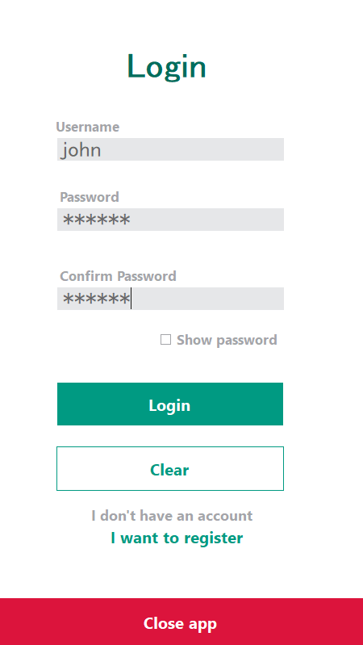
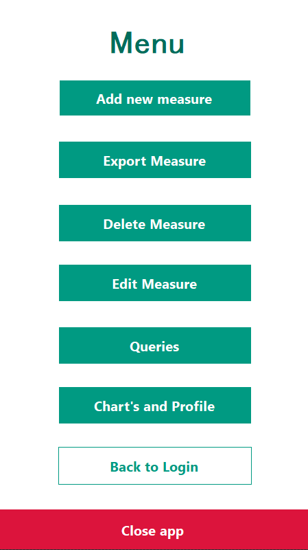
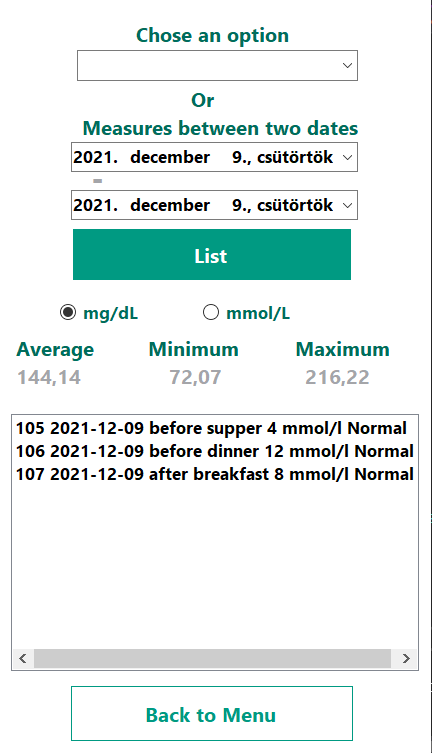
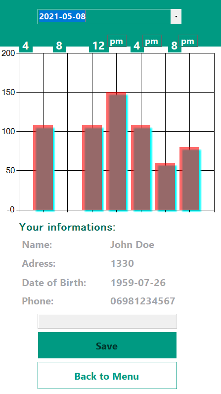
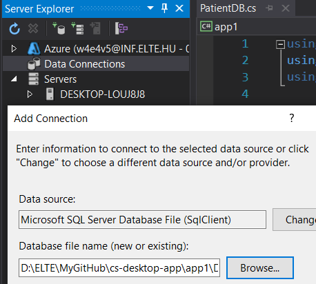
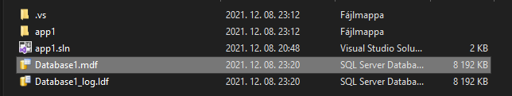
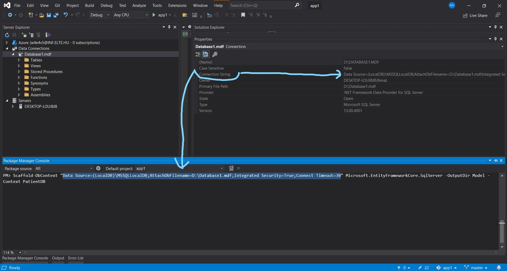
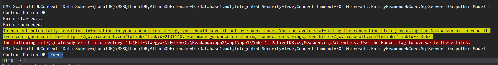

# 🩸 Blood Sugar Diary 💻📋📊📝

## Introduction

This application was one of my university assignments, it helps the user to keep track of her/his blood sugar measurements

 |  
----------------------- | ---------------
 | 

## How to run

- Data Connections - right click - Add Connection
- Browse the `Database1.mdf` (can be found in the project folder)
- Press <b>OK<b>

- Tools - NuGet Package Manager
- Package Manager Console
- `Scaffold-DbContext "here you paste the connection string" Microsoft.EntityFrameworkCore.SqlServer -OutputDir Model -Context PatientDB`
- Press Enter

- If red notification occurs, paste the command again with `-Force` at the end

 
 
 